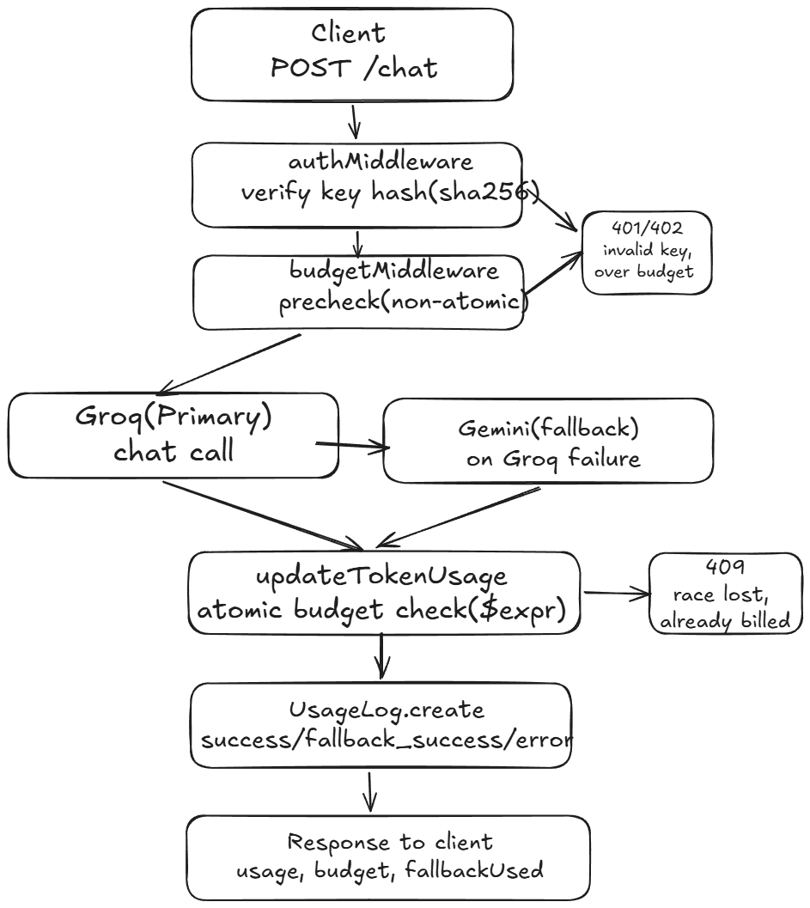

# DECISIONS.md

## What I built

I built a minimal LLM gateway that sits between callers and two LLM providers with Groq as primary, Gemini as fallback. Callers authenticate using  a gateway-issued virtual API key. Each key has a token budget, enforced through a pre-request check and an atomic post-request usage update, and every request  successful, fallen-back, or failed — is logged with its model, provider,token usage, estimated cost(only Groq) and timestamp, allowing usage and spend for each key to be queries through the /usage endpoint

## Moving parts & request lifecycle



```
Client
  │  POST /chat  (Authorization: Bearer sk-gw-...)
  ▼
authMiddleware
  │   Validate virtual API key format
  |   SHA-256 hash the raw key
  |   Look up VirtualKey using KeyHash
  |   Reject with 401 if missing or inactive 
  ▼
budgetMiddleware
  │   Re-fetch key, 
  |   Compute tokensRemaining = tokenBudget - tokensUsed
  │   Reject 403 if <= 0   (fast, non-atomic pre-check)
  ▼
chatCompletion controller
  │   Validate messages[] shape
  ▼
callLLM (providerService)
  │   Try Groq (primary)
  │    on any error → try Gemini (fallback)
  │      on both failing → throw, statusCode 503
  ▼
updateTokenUsage
  |    Atomic MongoDB findOneAndUpdate with $expr guard
  |
  |    tokensUsed + newTokens <= tokenBudget>
  |
  |    only increments tokensUsed if the condition is satisfied 
  |     
  |    If the key exists but condtion fails -> 402 Budget Exceeded
  │     
  ▼
UsageLog.create
  │  persists keyId, provider, model, tokensIn/out, estimatedCost,
  │  status (success / fallback_success / error), responseTime
  │  — written on the success path AND the error path, so spend
  │    is never lost even if a later step in the chain fails
  ▼
Response to client
  { message, provider, model, usage: {...}, fallbackUsed }
```

GET /api/usage is authenticated using the caller virtual key and aggregates UsageLog records by KeyId. this allow the gateway to answer how many requests and tokens a key has consumed and its estimated cost

POST /api/keys is an admin endpoint protected by an admin secret. it generate cryptographically random virtual key, stores only its SHA-256 hash in MongoDb, and returns the raw key

## Key decisions

### Decision 1 — Token-Based Budgeting

Options:

- Request count
- Token count
- Cost-based budgeting

Chosen: Token-based budgeting

I chose token-based budgeting because request-count budgeting does not account for how large each request is. For example, two callers may each make one request, but one request might consume 1,000 tokens while the other consumes 100,000 tokens. Treating both requests equally would not accurately represent their actual LLM usage.

I also considered cost-based budgeting. However, different models and providers have different pricing, which makes cost calculation and enforcement more complex. For this gateway, I chose token-based budgeting because it provides a simple and more usage-aware approach than request counting while avoiding the additional complexity of cost-based enforcement.

Tradeoff: Token usage does not perfectly represent financial cost because different models and providers can charge different prices for the same number of tokens. Therefore, two requests using the same number of tokens may still have different actual costs.


### Decision 2 — Immediate Fallback Without Retry

**Options considered:**

* Retry Groq before falling back
* Immediately fall back to Gemini
* Fail immediately without fallback

**Chosen:** Immediate fallback to Gemini without retrying Groq

If the Groq request fails, such as because of a timeout, rate limit (`429`), or server-side error (`5xx`), the gateway immediately attempts the same request using Gemini instead of retrying Groq first.

I chose this approach because retrying the same provider adds latency that the caller directly experiences. If Groq is temporarily unavailable or overloaded, switching to a different provider gives the request another independent path to succeed without waiting through multiple retries.

**Tradeoff:** A temporary Groq failure might have succeeded on a retry, so immediately switching providers can unnecessarily consume Gemini quota. My current implementation also does not distinguish between retryable and non-retryable errors. For example, a malformed request or certain client-side errors may also trigger Gemini even though retrying the same invalid request with another provider is unlikely to help.

With more time, I would classify provider errors and only trigger fallback for failures where fallback is useful, such as timeouts, rate limits, and provider-side `5xx` errors.

### Decision 3 — Non-Atomic Pre-Check + Atomic Post-Call Enforcement

**Options considered:**

* Only check the remaining budget before the provider call
* Reserve estimated tokens atomically before the provider call
* Use a simple pre-check followed by an atomic update using actual token usage

**Chosen:** Simple pre-check + atomic post-call enforcement

The gateway checks the budget twice. First, `budgetMiddleware` performs a simple read-and-compare check before calling the LLM provider. If the key has already exhausted its budget, the request is rejected immediately without making an unnecessary provider call.

After the provider responds and the actual token usage is known, `updateTokenUsage` performs an atomic MongoDB `findOneAndUpdate` with a `$expr` condition. The update only succeeds if:

`tokensUsed + newTokens <= tokenBudget`

This atomic update prevents two concurrent requests from independently updating the same key beyond its configured token budget.

**Tradeoff:** The main limitation is that the exact token usage is only known after the provider has already processed the request. Therefore, a request can consume provider tokens and then be rejected by the gateway because its actual usage exceeds the remaining budget. The atomic update protects the stored budget from being exceeded, but it does not completely prevent provider-side spending beyond the budget.

This is the decision I am least confident about. With more time, I would explore atomically reserving an estimated number of tokens before the provider call and then reconciling that reservation against the provider's actual token usage afterward.


## First Principles: Why Enforce Budgets at the Gateway Instead of Trusting Callers?

The gateway is the component that controls access to the real LLM provider credentials and observes the actual usage returned by the provider. Callers should not be trusted to report or enforce their own usage because they could misreport it, fail to track it correctly, or simply ignore the configured budget.

Budget enforcement should therefore happen at the boundary that has the authority to either allow or refuse an LLM request. Since the gateway holds the provider credentials, it is the last point at which the system can prevent a caller from spending provider resources.

If budget enforcement were left to callers, the budget would effectively become a suggestion rather than an enforceable control. Centralizing enforcement in the gateway also ensures that every caller follows the same budgeting rules regardless of how the client itself is implemented.

## Concurrency: Two Requests on a Near-Exhausted Key

Concurrency is partially handled, and this is one of the main limitations 

The pre-check in `budgetMiddleware` is a normal read-and-compare operation. This means two concurrent requests can both read `tokensRemaining > 0` and pass the initial budget check before either request updates the key's usage.

The actual concurrency protection happens after the provider call in `updateTokenUsage`. It uses an atomic MongoDB `findOneAndUpdate` with a `$expr` guard that only increments `tokensUsed` when:

`tokensUsed + newTokens <= tokenBudget`

Because the check and increment happen atomically, two concurrent requests cannot both update the stored usage if doing so would exceed the configured budget. One may succeed while the other receives a `402 Budget Exceeded` response.

**The gap:** By the time this atomic check happens, both requests may have already reached the real LLM provider and consumed tokens. The request that loses the atomic race is rejected by the gateway, but the provider-side cost has already been incurred and cannot be reversed.

Therefore, the current implementation protects the integrity of the stored token budget under concurrency, but it cannot guarantee that actual provider spending will never exceed the budget. In the worst case, the system can incur the cost of an additional in-flight request.

With more time, I would address this by atomically reserving an estimated token amount before calling the provider and then reconciling the reservation with the actual token usage after the response.

## Fallback Policy and Why

The gateway uses Groq as the primary provider and Gemini as the fallback. If the Groq request fails, the gateway immediately attempts the request with Gemini instead of retrying Groq first.

I chose this policy mainly for latency and simplicity. Retrying the same provider could increase the time the caller waits, while switching to a second provider gives the request an independent path to succeed. The tradeoff is that the current implementation falls back on every Groq error without distinguishing between retryable errors, such as timeouts, rate limits, and `5xx` responses, and non-retryable errors where trying another provider may not help.

One known correctness limitation is message translation between providers. My `toGeminiFormat` function currently removes `system` role messages instead of translating them into Gemini's equivalent system-instruction mechanism. As a result, if a request contains a system prompt and Groq fails, the Gemini fallback may generate a response without those original system instructions.


## What I Deliberately Did NOT Build

* **Reserve-then-commit budgeting.** A stronger implementation would atomically reserve an estimated number of tokens before the provider call and reconcile that reservation against the actual usage afterward. This would reduce the concurrency and overspending gap described above. I deliberately cut this for time and kept the simpler pre-check + atomic post-call accounting approach.

* **Retry logic.** I chose immediate provider fallback instead of retrying Groq first. This keeps the failure path simple and avoids adding retry latency to the request lifecycle. The tradeoffs of this decision are discussed in the fallback section above.

* **Gemini pricing in `costCalculator.js`.** Currently, only the Groq model has a configured pricing entry. Gemini fallback requests therefore record `estimatedCost: 0`. I chose not to hard-code pricing that I had not independently verified, since incorrect pricing would make the spend report misleading. A production version would keep provider/model pricing in validated configuration rather than embedding it directly in application logic.


* **Independent rate limiting.** The gateway enforces per-key token budgets but does not separately limit requests per second or requests per minute. These solve different problems: the token budget controls overall resource consumption, while rate limiting would protect the service against bursts and abuse.


## Least Confident Decision — Two-Layer Budget Enforcement

The decision I am least confident about is the two-layer budget design: a non-atomic pre-check before the provider call followed by atomic post-call enforcement using the actual token usage.

**For it:** The design is simple and fast in the common case. Most requests are not close to exhausting their budget, and the pre-check immediately blocks keys that are already exhausted, avoiding an unnecessary provider call. After a successful provider response, the atomic `findOneAndUpdate` ensures that `tokensUsed` is only incremented when the new usage still fits within the configured budget. This keeps the stored budget state consistent even when multiple requests arrive concurrently.

**Against it:** Under concurrency on a near-exhausted key, multiple requests can pass the initial pre-check and reach the LLM provider before any of them update the budget. Some of those requests may then fail the atomic post-call check, meaning the gateway rejects them even though real provider usage has already been incurred.

A stronger production design would use a **reserve-then-reconcile** approach: estimate and atomically reserve budget before calling the provider, reject the request if the reservation cannot be made, and then reconcile the reservation against the actual token usage returned by the provider.


## Where It Breaks, and What I'd Do With One More Week

* **Provider overspend under concurrency.** Multiple requests on a near-exhausted key can pass the pre-check and reach the provider before the atomic post-call budget update occurs. I would replace the current approach with a reserve-then-reconcile design that atomically reserves estimated tokens before making the provider call.

* **Gemini fallback cost is recorded as zero.** The current cost calculator only contains verified pricing for the configured Groq model. I would add verified Gemini model pricing and move pricing information into configuration so it can be updated independently as provider pricing changes.

* **System prompts are lost during fallback.** The current Groq-to-Gemini message conversion filters out `system` messages. I would preserve their semantics by translating them into Gemini's corresponding system-instruction mechanism.

* **Fallback policy is too broad.** Currently, any Groq failure triggers Gemini immediately. I would classify provider errors and add at most one retry for transient failures such as timeouts and `5xx` responses. Client-side `4xx` errors that indicate an invalid request would fail immediately rather than unnecessarily reaching the fallback provider.


If I had one additional week, my first priority would be strengthening budget correctness rather than adding features such as semantic caching, advanced routing, or a frontend.
